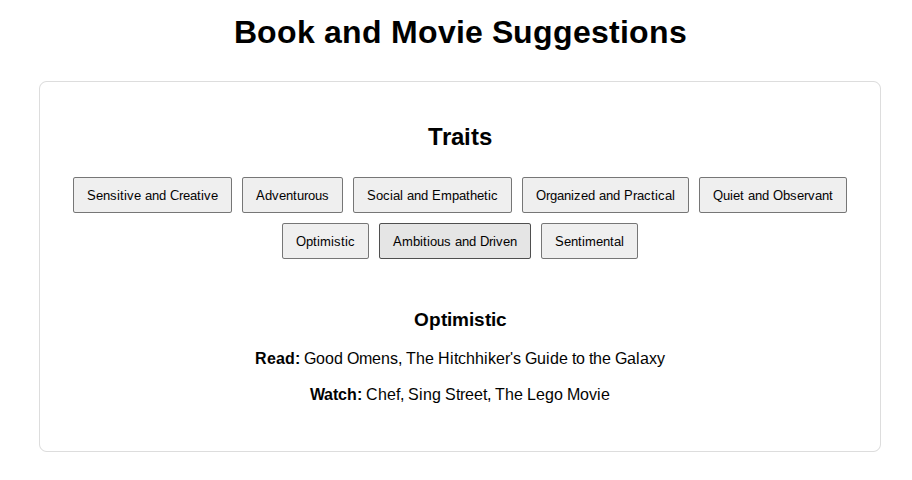

# Entry 5
##### 4/13/2026


### Context
In the past few weeks we have been finishing up making our MVP and also learning our tool at the same time. There hasn't been much tool learning, most of it has just been coding our projects and making a working version of it but below are some parts of my learning log.


``` js
const point3 = { x: 12, y: 26, z: 89 };
logPoint(point3); // logs "12, 26"
const rect = { x: 33, y: 3, width: 30, height: 80 };
logPoint(rect); // logs "33, 3"
const color = { hex: "#187ABF" };
logPoint(color);
Arguments of type '{ hex: string; }' are not assignable to parameters of type 'Point'.
 Type '{ hex: string; }' is missing the following properties from type 'Point': x, y
```
* `point` and `Point` are different but `point` is being compared to `Point`


``` js
class VirtualPoint {
 x: number;
 y: number;
 constructor(x: number, y: number) {
   this.x = x;
   this.y = y;
 }
}
const newVPoint = new VirtualPoint(13, 56);
logPoint(newVPoint); // logs "13, 56"
```
* There is not a difference between classes and objects conform when it comes to shapes


``` js
class Student {
 fullName: string;
 constructor(
   public firstName: string,
   public middleInitial: string,
   public lastName: string
 ) {
   this.fullName = firstName + " " + middleInitial + " " + lastName;
 }
}
interface Person {
 firstName: string;
 lastName: string;
}
function greeter(person: Person) {
 return "Hello, " + person.firstName + " " + person.lastName;
}
let user = new Student("Jane", "M.", "User");
document.body.textContent = greeter(user);
```
* `public` has similar functions to `var` which is used to create properties with a certain name.


``` js
function greeter(person) {
 return "Hello, " + person;
}
let user = "Jane User";
document.body.textContent = greeter(user);
```
* Basically returns Hello and the value of person is already set to "Jane User" so it will print out "Hello Jane User"


``` js
class Student {
 fullName: string;
 constructor(
   public firstName: string,
   public middleInitial: string,
   public lastName: string
 ) {
   this.fullName = firstName + " " + middleInitial + " " + lastName;
 }
}
interface Person {
 firstName: string;
 lastName: string;
}
function greeter(person: Person) {
 return "Hello, " + person.firstName + " " + person.lastName;
}
let user = new Student("Jane", "M.", "User");
document.body.textContent = greeter(user);
```
* `public` is used to allow for the user to automatically create properties with that name


Below is some code from my MVP


``` js
var option = function(id, names, books, movies) {
               if (choice !== id && choice !== "both") return;
               var zone = document.getElementById(id);
               var btnContainer = document.getElementById(id + "-buttons");
               var displayContainer = document.getElementById(id + "-display");
              
               zone.style.display = "block";
              
               // making of buttons
               names.forEach(function(name, i) {
                   var button = document.createElement("button");
                   button.innerText = name;
                   button.style.margin = "5px";
                   button.onclick = function() {
                       var pick = (arr) => [...arr].sort(() => 0.5 - Math.random()).slice(0, Math.floor(Math.random() * 2) + 2).join(", ");
                       displayContainer.innerHTML = "<h3>" + name + "</h3><p><b>Read:</b> " + pick(books[i]) + "</p><p><b>Watch:</b> " + pick(movies[i]) + "</p>";
                   };


                   btnContainer.appendChild(button);
               });
           };
```
This made the foundation of my project along with 4 arrays and below is a piece of the working product.





Each trait gives different books and movies suggestions and they are randomly generated.


### EDP(Engineering Design Process)
We just finished step 5 which is building a working website for our project next is step 7 which is improving it as we move onto Beyond MVP.


### Sources
My main sources were my [tool](https://www.typescriptlang.org/docs/handbook/typescript-tooling-in-5-minutes.html) and
my [website](https://tinax8774.github.io/sep11-freedom-project/)


### Skills
One skill is time management because I had to find time to balance trying to follow my timeline and finish my project while also trying to stay on top of my workload for other classes at the same time.


Another skill is debugging because while coding my projects I ran into many problems with my code including it not working properly or just writing something wrong in general.


[Previous](entry04.md) | [Next](entry06.md)


[Home](../README.md)
